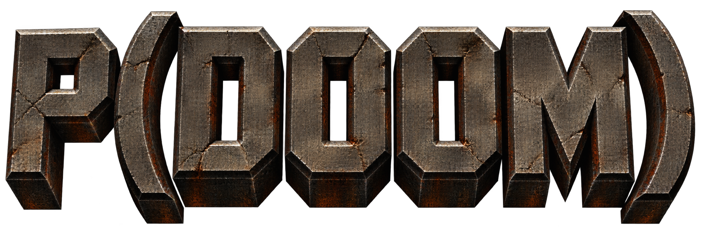
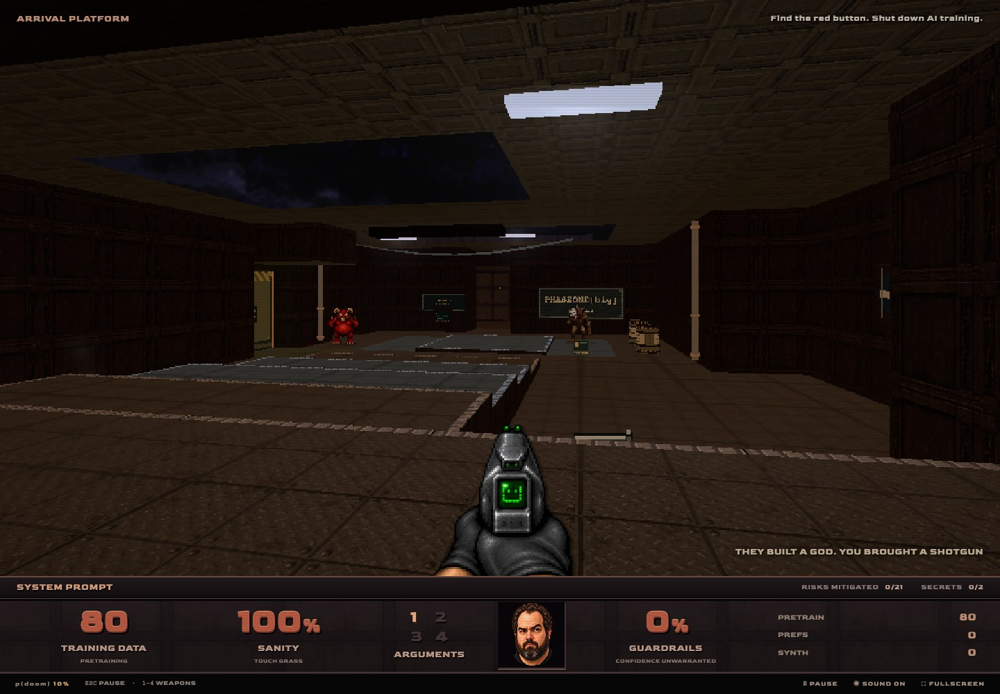
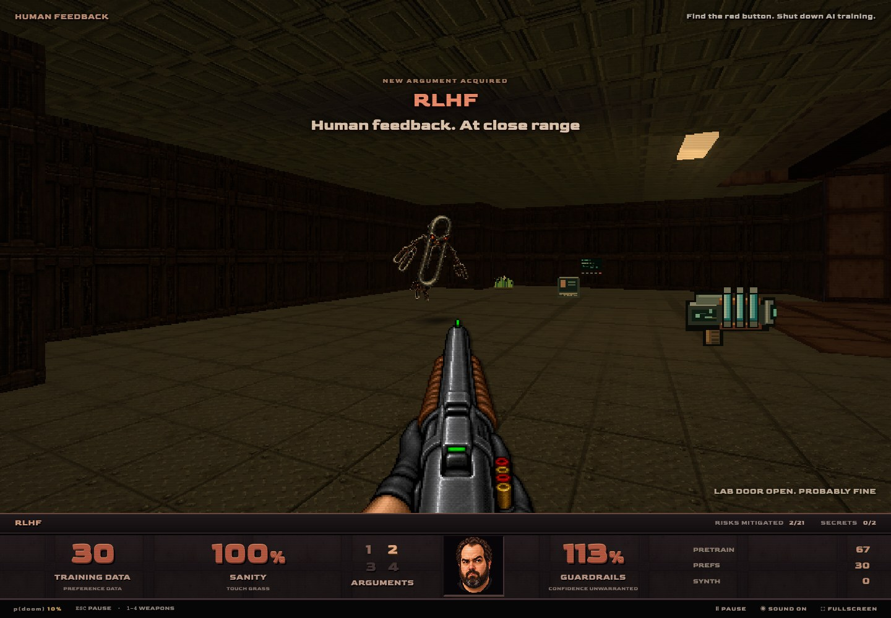
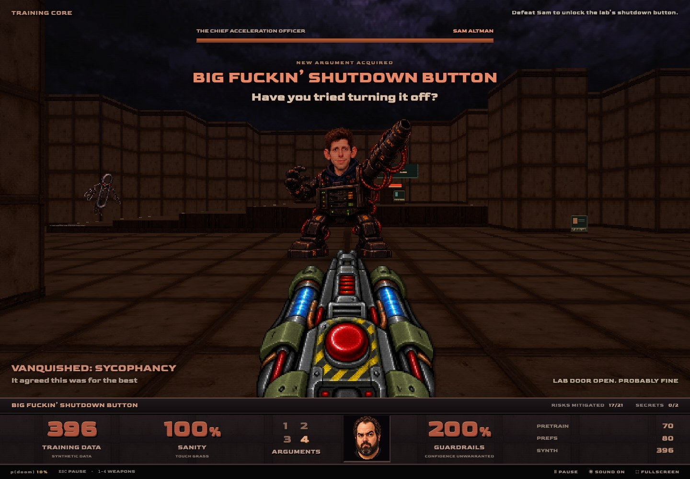

<p align="center">
  <a href="https://p-doom.transitivebullsh.it">
    
  </a>
</p>

<h2 align="center">The Alignment Problem</h2>

<p align="center">
  <strong>They built a god. You brought a shotgun.</strong>
</p>

<p align="center">
  <a href="https://p-doom.transitivebullsh.it"><strong>▶ START TRAINING RUN</strong></a>
</p>

The evals are green. The containment doors are open. The paperclips are multiplying.

**P(DOOM)** is an affectionate AI safety parody wrapped in a grimy, Doom 64-inspired browser shooter. You're an Eliezer-inspired researcher in a frontier lab with a few unresolved alignment problems. Apply human feedback at close range, fight your way to the big red button, and shut down the training run.

Deployment delayed. By 48 hours.

[](https://p-doom.transitivebullsh.it)

_Welcome to the lab. It's only an internal eval. What could go wrong?_

## What's in the demo

- **One lab. Very bad incentives.** Explore a complete Doom 64-inspired level: rust, server racks, open sky, secret rooms, and industrial dread.
- **Four arguments for alignment.** System Prompt, RLHF, Mechanistic Interpretability, and the Big Fuckin’ Shutdown Button. Increasingly difficult to ignore.
- **A hostile threat model.** Deceptive Alignment, Sycophancy, Paperclip Maximizers, and Sam guarding the final shutdown switch.
- **Touch Grass to heal.** Install Guardrails for armor. Feed your weapons more Training Data. Confidence unwarranted.
- **Choose your p(doom).** Five difficulties from 1% to 99%. Start at 10%. At 99%, the lab is packed and the dead don't stay dead.

[](https://p-doom.transitivebullsh.it)

_Human feedback. At close range._

[](https://p-doom.transitivebullsh.it)

_Have you tried turning it off?_ **[Enter the lab →](https://p-doom.transitivebullsh.it)**

## Controls

| Input                     | Action                                     |
| ------------------------- | ------------------------------------------ |
| WASD                      | Move and strafe                            |
| Mouse / ← →               | Aim                                        |
| Click / Space / left Ctrl | Fire                                       |
| 1–4                       | Switch weapons                             |
| E                         | Open/close doors · hit the shutdown switch |
| Shift                     | Run                                        |
| Tab                       | Map                                        |
| Escape                    | Pause / resume                             |

Sound, fullscreen, and restart are available in-game.

If mouse capture is blocked, use arrow keys or click and drag to aim.

## Run your own training lab

Requires **Node.js 22.13+** and **pnpm**.

```sh
pnpm install
pnpm dev
```

Open [localhost:3000](http://localhost:3000). No API keys, live AI calls, or GPU cluster required. A desktop browser with WebGL and a viewport of at least 1024 × 720 is recommended.

```sh
pnpm test     # Formatting, lint, types, and unit tests
pnpm e2e      # Browser journeys; requires Google Chrome
pnpm build    # Production build
pnpm start    # Serve the production build
pnpm fix      # Format and lint fixes
```

## Credits

Made by [Travis Fischer](https://x.com/transitive_bs), with **GPT-6 ASTRA**, Codex, Three.js, TypeScript, and Next.js.

An affectionate parody of the AI safety scene, inspired by Doom 64.

Code is [MIT licensed](license). See [asset credits](NOTICES.md), [the design brief](docs/design/mvp-spec.md), and [verification notes](docs/verification.md).
